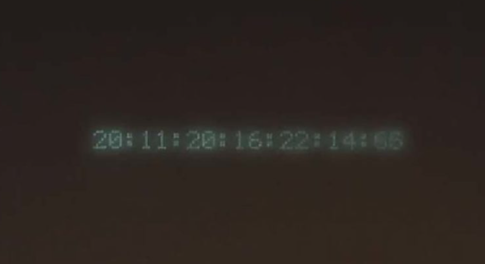
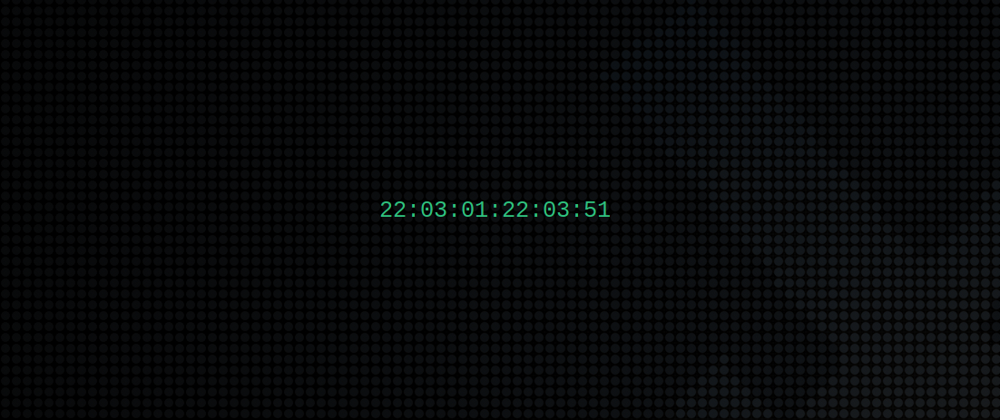

At one point in the movie Tron Legacy, we see this screensaver:

It looks like it could be in the format `YY:MM:DD:hh:mm:ss:milliseconds`, however the movie is supposed to happen around 2010... but let's use this format anyway.

This repository contains two parts:

1. `tron-clock.c` which displays the following clock:

which can also be shown in a binary format, to make it arguably prettier:

2. `tron.sh`, a simple bash script that waits for inactivity from the user and starts `tron-clock`. It was simpler than writting a module for an existing screensaver program, and it exactly meets the needs of my application. However, it's custom made for MX Linux 21 with XFCE, so it will need to be tweaked in order to work on another environment.

## Setup

- Install dependencies: `apt-get install libncurses-dev unclutter-xfixes xprintidle`
- Clone this repository
- Build `tron-clock`: `gcc -Wall -o tron-clock tron-clock.c -lncursesw`
- Check that `tron.sh` and `tron-clock` are executable
- Set up `tron.sh` to start at login (Menu → Session and startup → Application autostart)

Look at the code for customisation options.
